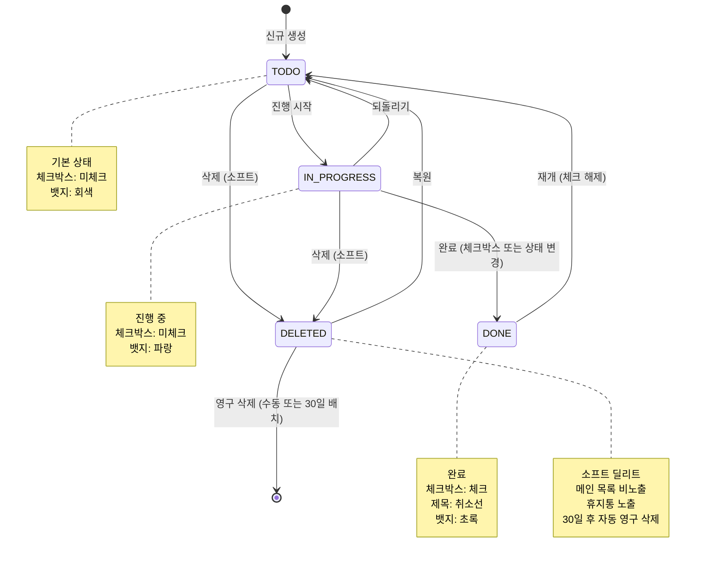

# 작업 상태 관리 정책 — 사내 작업 관리 도구

> 버전: 1.0.0
> 최종 수정일: 2026-04-07
> 작성 대상: 백엔드 개발자, 프론트엔드 개발자, 기획자

---

## 목차

1. [상태 정의](#1-상태-정의)
2. [상태 전이 매트릭스](#2-상태-전이-매트릭스)
3. [전이별 상세 명세](#3-전이별-상세-명세)
4. [상태 머신 다이어그램](#4-상태-머신-다이어그램)
5. [리마인더 상태 연동](#5-리마인더-상태-연동)
6. [소프트 딜리트 생명주기](#6-소프트-딜리트-생명주기)
7. [updatedAt 갱신 규칙](#7-updatedat-갱신-규칙)
8. [상태별 필터링 규칙](#8-상태별-필터링-규칙)
9. [v2 상태 확장 계획](#9-v2-상태-확장-계획)

---

## 1. 상태 정의

Todo 항목은 `status` 필드를 통해 다음 네 가지 상태 중 하나를 가진다. `DELETED`는 `status` 값이 아니라 `isDeleted` 플래그로 구현되지만, 상태 머신 관점에서 하나의 상태로 취급한다.

### 1-1. TODO

| 항목 | 내용 |
|------|------|
| **한국어 레이블** | 할 일 |
| **의미** | 아직 시작하지 않은 작업. 생성 직후의 기본 상태. |
| **진입 조건** | 신규 생성 시 자동 부여. 또는 IN_PROGRESS → TODO 전이(되돌리기). DONE → TODO 전이(재개). |
| **UI 색상** | 회색 (`gray-500`) |
| **UI 아이콘** | 빈 원형 아이콘 (`○`) |
| **UI 스타일** | 카드 배경 흰색. 제목 정상 표시. 체크박스 미체크 상태. |
| **허용 다음 상태** | IN_PROGRESS, DELETED |
| **진입 사이드 이펙트** | 없음 |

### 1-2. IN_PROGRESS

| 항목 | 내용 |
|------|------|
| **한국어 레이블** | 진행 중 |
| **의미** | 현재 작업 중인 항목. 명시적으로 시작 처리한 상태. |
| **진입 조건** | TODO → IN_PROGRESS 전이. |
| **UI 색상** | 파랑 (`blue-500`) |
| **UI 아이콘** | 반쪽 채워진 원형 아이콘 (`◑`) |
| **UI 스타일** | 카드 좌측 보더 파랑 강조. 상태 뱃지 파랑. 체크박스 미체크 상태. |
| **허용 다음 상태** | TODO, DONE, DELETED |
| **진입 사이드 이펙트** | 없음 (v2에서 startedAt 기록 예정) |

### 1-3. DONE

| 항목 | 내용 |
|------|------|
| **한국어 레이블** | 완료 |
| **의미** | 작업이 완료된 항목. 체크박스 체크 동작으로 진입 가능. |
| **진입 조건** | IN_PROGRESS → DONE 전이. 또는 체크박스 체크 시 현재 상태와 무관하게 DONE으로 전이. |
| **UI 색상** | 초록 (`green-500`) |
| **UI 아이콘** | 체크 원형 아이콘 (`✓`) |
| **UI 스타일** | 카드 배경 연한 초록. 제목에 취소선. 체크박스 체크 상태. 불투명도 70%. |
| **허용 다음 상태** | TODO (체크 해제 → 재개) |
| **진입 사이드 이펙트** | 연결된 Reminder가 있으면 `isSent = true`로 마킹하여 더 이상 발송하지 않음. `completedAt` 필드 기록. |

### 1-4. DELETED (소프트 딜리트)

| 항목 | 내용 |
|------|------|
| **한국어 레이블** | 삭제됨 |
| **의미** | 사용자가 삭제한 항목. `isDeleted = true`로 표현. 30일 후 배치 작업으로 영구 삭제. |
| **진입 조건** | 임의의 상태에서 삭제 버튼 클릭 + ConfirmDialog 확인. |
| **UI 색상** | 없음 (메인 목록 비노출) |
| **UI 아이콘** | 없음 |
| **UI 스타일** | /trash 페이지에서만 TrashCard 형태로 노출. 남은 일수 뱃지 표시. |
| **허용 다음 상태** | TODO (복원), 영구 삭제 (상태 없음, DB에서 제거) |
| **진입 사이드 이펙트** | `deletedAt` 기록. 연결된 Reminder 모두 취소. `isDeleted = true` 플래그 설정. |

---

## 2. 상태 전이 매트릭스

행(Row)은 현재 상태, 열(Column)은 목표 상태를 나타낸다.

- `✅` : 전이 허용
- `❌` : 전이 불가 (UI에서 해당 액션 비활성화 또는 미노출)
- `-` : 자기 자신으로의 전이 (해당 없음)

|                     | **→ TODO** | **→ IN_PROGRESS** | **→ DONE** | **→ DELETED** |
|---------------------|:----------:|:-----------------:|:----------:|:-------------:|
| **TODO →**          | -          | ✅                | ❌         | ✅            |
| **IN_PROGRESS →**   | ✅         | -                 | ✅         | ✅            |
| **DONE →**          | ✅         | ❌                | -          | ❌            |
| **DELETED →**       | ✅ (복원)  | ❌                | ❌         | -             |

### 제약 사항 설명

| 불가 전이 | 이유 |
|-----------|------|
| TODO → DONE | 시작하지 않은 작업을 바로 완료 처리하는 것은 의미상 부적절. 체크박스는 IN_PROGRESS 상태에서만 완료 전이를 허용함. 단, UX 관점에서 재검토 여지 있음 (→ v2 논의) |
| DONE → IN_PROGRESS | 완료된 작업을 다시 진행 중으로 되돌리려면 TODO로 먼저 재개 후 IN_PROGRESS로 전환. 직접 전이 방지로 이력 명확화. |
| DONE → DELETED | 완료된 항목은 영구적 기록으로 취급. 삭제 불가. 단, v2 정책 변경 시 재검토 가능. |
| DELETED → IN_PROGRESS | 복원 시 항상 TODO 상태로만 복원하여 사용자가 명시적으로 상태를 재설정하도록 유도. |
| DELETED → DONE | 삭제된 항목을 완료 처리하는 것은 의미 없음. |

---

## 3. 전이별 상세 명세

### 3-1. TODO → IN_PROGRESS

| 항목 | 내용 |
|------|------|
| **트리거** | TodoCard 내 상태 뱃지 클릭 → "진행 중으로 변경" 옵션 선택 |
| **API Endpoint** | `PATCH /api/todos/:id` |
| **Payload** | `{ "status": "IN_PROGRESS" }` |
| **사이드 이펙트** | `updatedAt` 갱신 |
| **Optimistic UI** | 적용. 즉시 상태 뱃지를 "진행 중"으로 변경 후 API 호출. |
| **UI 피드백** | 상태 뱃지 색상 변경 애니메이션 (fade transition 200ms). 성공 토스트 없음 (조용한 업데이트). |
| **실패 시 처리** | 이전 상태(TODO)로 Optimistic UI 롤백. 에러 토스트 표시: "상태 변경에 실패했습니다." |

---

### 3-2. IN_PROGRESS → TODO

| 항목 | 내용 |
|------|------|
| **트리거** | TodoCard 내 상태 뱃지 클릭 → "할 일로 되돌리기" 옵션 선택 |
| **API Endpoint** | `PATCH /api/todos/:id` |
| **Payload** | `{ "status": "TODO" }` |
| **사이드 이펙트** | `updatedAt` 갱신 |
| **Optimistic UI** | 적용. |
| **UI 피드백** | 상태 뱃지 색상 변경 애니메이션. 성공 토스트 없음. |
| **실패 시 처리** | 이전 상태(IN_PROGRESS)로 롤백. 에러 토스트 표시. |

---

### 3-3. IN_PROGRESS → DONE

| 항목 | 내용 |
|------|------|
| **트리거** | TodoCard 체크박스 클릭 (상태가 IN_PROGRESS인 경우). 또는 상태 뱃지 → "완료" 선택. |
| **API Endpoint** | `PATCH /api/todos/:id` |
| **Payload** | `{ "status": "DONE" }` |
| **사이드 이펙트** | `updatedAt` 갱신. `completedAt` 필드에 현재 타임스탬프 기록. 연결된 Reminder가 있으면 `isSent = true`로 업데이트. |
| **Optimistic UI** | 적용. 즉시 체크박스 체크, 제목 취소선, 카드 배경 연한 초록. |
| **UI 피드백** | 카드 완료 애니메이션 (체크 아이콘 팝 효과 + 배경 색상 전환 300ms). 성공 토스트: "완료되었습니다! 🎉" |
| **실패 시 처리** | 체크박스 해제 + 카드 원상 복원. 에러 토스트: "완료 처리에 실패했습니다." |

---

### 3-4. DONE → TODO

| 항목 | 내용 |
|------|------|
| **트리거** | 완료된 TodoCard의 체크박스 클릭 (체크 해제). |
| **API Endpoint** | `PATCH /api/todos/:id` |
| **Payload** | `{ "status": "TODO" }` |
| **사이드 이펙트** | `updatedAt` 갱신. `completedAt` 필드를 `null`로 초기화. |
| **Optimistic UI** | 적용. 즉시 체크박스 해제, 취소선 제거, 배경 복원. |
| **UI 피드백** | 카드 복원 애니메이션 (취소선 페이드 아웃 200ms). 성공 토스트 없음. |
| **실패 시 처리** | 체크박스 재체크, 카드 DONE 스타일 복원. 에러 토스트: "상태 변경에 실패했습니다." |

---

### 3-5. 임의 상태 → DELETED (소프트 딜리트)

적용 가능 출발 상태: TODO, IN_PROGRESS

| 항목 | 내용 |
|------|------|
| **트리거** | TodoCard 삭제 버튼 클릭 → ConfirmDialog "삭제" 버튼 확인 |
| **API Endpoint** | `DELETE /api/todos/:id` (내부적으로 소프트 딜리트) |
| **Payload** | 없음 (Path Parameter만 사용) |
| **사이드 이펙트** | `isDeleted = true` 설정. `deletedAt` 현재 타임스탬프 기록. `updatedAt` 갱신. 연결된 Reminder 전체 취소 (cancelled 상태로 업데이트). |
| **Optimistic UI** | 적용. 확인 즉시 목록에서 카드 슬라이드 아웃 애니메이션 후 제거. |
| **UI 피드백** | 카드 슬라이드 아웃 애니메이션 (translateX + opacity, 250ms). 성공 토스트: "할일이 삭제되었습니다. 휴지통에서 복원할 수 있습니다." (액션 링크 포함) |
| **실패 시 처리** | 목록에 카드 재삽입. 에러 토스트: "삭제에 실패했습니다." |

---

### 3-6. DELETED → TODO (복원)

| 항목 | 내용 |
|------|------|
| **트리거** | TrashCard 복원 버튼 클릭 |
| **API Endpoint** | `PATCH /api/todos/:id/restore` |
| **Payload** | 없음 |
| **사이드 이펙트** | `isDeleted = false`. `deletedAt = null`. `status = "TODO"`로 초기화. `updatedAt` 갱신. |
| **Optimistic UI** | 적용. 휴지통에서 카드 즉시 제거. |
| **UI 피드백** | TrashCard 슬라이드 아웃. 성공 토스트: "복원되었습니다. 할일 목록에서 확인하세요." (할일 목록 링크 포함) |
| **실패 시 처리** | 카드 재노출. 에러 토스트: "복원에 실패했습니다." |

---

### 3-7. DELETED → 영구 삭제

| 항목 | 내용 |
|------|------|
| **트리거 (수동)** | TrashCard 영구 삭제 버튼 클릭 → ConfirmDialog 확인 |
| **트리거 (자동)** | 배치 작업: `deletedAt`으로부터 30일 경과 시 |
| **API Endpoint** | `DELETE /api/todos/:id/permanent` |
| **Payload** | 없음 |
| **사이드 이펙트** | DB에서 레코드 완전 제거. 연결된 Reminder, Tag, Category 연결 테이블 레코드도 CASCADE 삭제. |
| **Optimistic UI** | 적용. TrashCard 즉시 제거. |
| **UI 피드백** | TrashCard 페이드 아웃. 성공 토스트: "영구 삭제되었습니다." |
| **실패 시 처리** | 카드 재노출. 에러 토스트: "영구 삭제에 실패했습니다." |

---

## 4. 상태 머신 다이어그램



---

## 5. 리마인더 상태 연동

리마인더(Reminder)는 Todo 항목에 선택적으로 연결되는 알림 레코드다. Todo 상태 변경 시 리마인더 상태도 함께 관리해야 한다.

### 5-1. 리마인더 생성 조건

| 조건 | 동작 |
|------|------|
| Todo 생성 시 `dueDate`가 설정된 경우 | `dueDate` 하루 전 09:00 리마인더 자동 생성 |
| Todo 수정 시 `dueDate`가 변경된 경우 | 기존 리마인더 취소 후 신규 리마인더 생성 |
| `dueDate`가 오늘이거나 과거인 경우 | 리마인더 생성하지 않음 (즉시 발송 불가) |

### 5-2. 리마인더 취소 조건

| 트리거 | 동작 |
|--------|------|
| Todo가 DONE 상태로 전이 | 연결된 리마인더 `isSent = true` 처리 (발송 스킵) |
| Todo가 DELETED 상태로 전이 | 연결된 리마인더 `isCancelled = true` 처리 |
| `dueDate`가 제거(null)된 경우 | 연결된 리마인더 취소 |

### 5-3. 리마인더 재생성 조건

| 트리거 | 동작 |
|--------|------|
| DONE → TODO 전이 (재개) | `dueDate`가 미래인 경우 리마인더 신규 생성 |
| DELETED → TODO 전이 (복원) | `dueDate`가 미래인 경우 리마인더 신규 생성 |
| `dueDate` 재설정 | 취소된 리마인더 재생성 (미래 날짜인 경우에만) |

### 5-4. isSent 관리 규칙

| 상황 | isSent 값 | 설명 |
|------|-----------|------|
| 리마인더 생성 직후 | `false` | 아직 발송 전 |
| 스케줄러가 알림 발송 완료 | `true` | 다시 발송하지 않음 |
| Todo가 DONE으로 전이 | `true` | 발송 불필요로 스킵 처리 |
| 리마인더 재생성 시 | `false` | 새 레코드 생성, 이전 레코드는 취소 유지 |

---

## 6. 소프트 딜리트 생명주기

### 6-1. 전체 생명주기 흐름

```
[신규 생성]
    │
    ▼
isDeleted = false
deletedAt = null
    │
    │  (사용자 삭제 액션)
    ▼
isDeleted = true
deletedAt = 현재 타임스탬프 ──────────────────────────────────────────┐
    │                                                                  │
    │  (복원 액션)                                                      │
    ▼                                                                  │
isDeleted = false                                               30일 경과
deletedAt = null                                                      │
status = "TODO"                                                       │
    │                                                                  ▼
    │                                                     [배치 작업 영구 삭제]
    ▼                                                      DB 레코드 완전 제거
    (재사용)
```

### 6-2. isDeleted 플래그 관리 규칙

| 필드 | 타입 | 기본값 | 설명 |
|------|------|--------|------|
| `isDeleted` | `Boolean` | `false` | 소프트 딜리트 여부 |
| `deletedAt` | `DateTime?` | `null` | 소프트 딜리트 시각 |

- `isDeleted = true`인 레코드는 일반 API 응답에서 필터링 제외
- `/api/todos` 조회 시 `WHERE isDeleted = false` 조건 필수
- `/api/todos/trash` 조회 시 `WHERE isDeleted = true` 조건 사용

### 6-3. 30일 배치 규칙

- 매일 00:00 (서버 로컬 타임 기준) 배치 작업 실행
- 조건: `isDeleted = true AND deletedAt <= NOW() - INTERVAL 30 DAY`
- 처리: 해당 레코드 및 연결 데이터 CASCADE DELETE
- 로깅: 삭제된 레코드 수를 배치 로그에 기록
- 실패 시: 에러 로깅 후 다음 배치 사이클에 재시도

### 6-4. /trash UI에서 남은 일수 계산

```
remainingDays = 30 - FLOOR((NOW() - deletedAt) / 1일)
```

| 남은 일수 | 뱃지 색상 | 텍스트 |
|-----------|-----------|--------|
| 8일 이상 | 회색 | "N일 후 삭제" |
| 3~7일 | 주황 | "N일 후 삭제" |
| 1~2일 | 빨강 | "곧 삭제됩니다" |
| 당일 | 빨강 (강조) | "오늘 삭제됩니다" |

### 6-5. GDPR 고려사항

| 항목 | 현재 구현 | v2 권고사항 |
|------|-----------|-------------|
| 개인정보 포함 필드 | `title`, `description`, `tags` | 암호화 또는 익명화 검토 |
| 삭제 요청 대응 | 소프트 딜리트 후 30일 배치 삭제 | 즉시 영구 삭제 API 제공 필요 |
| 데이터 내보내기 | 미구현 | JSON/CSV 내보내기 기능 추가 |
| 삭제 확인 응답 | 미구현 | 사용자 계정 삭제 시 모든 Todo 즉시 영구 삭제 + 확인 이메일 발송 |
| 보존 기간 고지 | 30일 안내 UI 있음 | 개인정보 처리방침 페이지에 명시 필요 |

---

## 7. updatedAt 갱신 규칙

`updatedAt`은 사용자가 의도적으로 데이터를 변경했을 때만 갱신한다. 시스템 내부 처리에 의한 변경은 갱신하지 않는 것을 원칙으로 한다.

### 7-1. updatedAt 갱신 O (사용자 의도적 변경)

| 작업 | 설명 |
|------|------|
| 제목 수정 | InlineEditTitle 저장 |
| 설명 수정 | TodoModal 저장 |
| 상태 변경 | 체크박스, 상태 뱃지 클릭 |
| 우선순위 변경 | PriorityDropdown 선택 |
| 마감일 변경 | DatePicker 선택 저장 |
| 카테고리 변경 | 카테고리 선택 저장 |
| 태그 변경 | 태그 추가/제거 |
| 소프트 딜리트 | 사용자 삭제 액션 |
| 복원 | 사용자 복원 액션 |

### 7-2. updatedAt 갱신 X (시스템 내부 처리)

| 작업 | 이유 |
|------|------|
| 리마인더 `isSent` 변경 | 스케줄러 처리. 사용자 변경 아님. |
| 리마인더 `isCancelled` 변경 | 시스템 사이드 이펙트. |
| 배치 작업에 의한 영구 삭제 | 삭제 전 마지막 갱신 시점 유지 (이미 의미 없음). |
| 읽음 처리 (v2) | 조회 액션은 updatedAt 변경 대상 아님. |

---

## 8. 상태별 필터링 규칙

### 8-1. 메인 목록 (/todos) 표시 여부

| 상태 | 기본 목록 노출 | 필터 선택 가능 | 비고 |
|------|---------------|---------------|------|
| TODO | ✅ | ✅ | 기본 필터 활성 상태에 포함 |
| IN_PROGRESS | ✅ | ✅ | 기본 필터 활성 상태에 포함 |
| DONE | ✅ | ✅ | 기본적으로 노출. 필터로 숨길 수 있음. |
| DELETED | ❌ | ❌ | 메인 목록에서 완전 비노출 |

### 8-2. 휴지통 (/trash) 표시 여부

| 상태 | 휴지통 노출 | 비고 |
|------|------------|------|
| TODO | ❌ | — |
| IN_PROGRESS | ❌ | — |
| DONE | ❌ | — |
| DELETED | ✅ | `isDeleted = true`인 항목만 |

### 8-3. 기본 필터 초기값

앱 최초 진입 시 적용되는 기본 필터 상태:

| 필터 | 초기값 | 의미 |
|------|--------|------|
| 상태 필터 | TODO, IN_PROGRESS, DONE 모두 활성 | 전체 표시 |
| 우선순위 필터 | HIGH, MEDIUM, LOW 모두 활성 | 전체 표시 |
| 카테고리 필터 | 선택 없음 (전체) | 전체 표시 |

### 8-4. 필터 조합 로직

- 복수 필터 선택 시 같은 종류 내에서는 OR 조건
- 다른 종류의 필터 간에는 AND 조건
- 예시: `상태=TODO,IN_PROGRESS AND 우선순위=HIGH AND 카테고리=개발`

---

## 9. v2 상태 확장 계획

### 9-1. ARCHIVED 상태 추가 고려

DONE과 DELETED 사이의 중간 상태로, 장기 보관이 필요한 완료 항목을 위해 도입을 고려한다.

| 항목 | 내용 |
|------|------|
| **의미** | 완료 후 일정 기간 보존이 필요하지만 메인 목록에서 숨기고 싶은 항목 |
| **진입 조건** | DONE → ARCHIVED (명시적 아카이브 액션) |
| **허용 다음 상태** | DONE (복원), DELETED |
| **전이 매트릭스 변경** | DONE → ARCHIVED 추가. ARCHIVED → DONE, ARCHIVED → DELETED 추가. |
| **UI** | 별도 /archive 페이지 또는 /todos에서 필터로 접근 |
| **고려 사항** | DONE과 ARCHIVED의 차이를 사용자에게 명확히 전달해야 함. 혼란 가능성 있음. |

### 9-2. 팀 협업 시 상태 변경 권한 규칙 (v2 다중 사용자)

팀 기능 도입 시 상태 변경 권한을 역할(Role)에 따라 제한한다.

| 역할 | 허용 상태 변경 | 제한 상태 변경 |
|------|---------------|---------------|
| **작성자 (Owner)** | 전체 허용 | — |
| **팀원 (Member)** | TODO → IN_PROGRESS, IN_PROGRESS → DONE | DELETED 전이는 작성자만 가능 |
| **뷰어 (Viewer)** | 없음 (읽기 전용) | 전체 |

- 권한 없는 상태 변경 시도 시: 에러 토스트 + 서버 403 응답
- 다른 사람의 항목 삭제는 관리자(Admin)만 가능

### 9-3. BLOCKED 상태 (의존성 기반)

다른 Todo 항목이 완료되어야 진행 가능한 블로킹 의존성을 표현하는 상태.

| 항목 | 내용 |
|------|------|
| **의미** | 선행 Todo가 완료되지 않아 시작할 수 없는 대기 상태 |
| **진입 조건** | 의존 Todo가 DONE이 아닌 상태에서 현재 Todo의 `blockedBy` 관계가 설정된 경우 자동 전이 |
| **자동 해제 조건** | 모든 선행 Todo가 DONE 상태가 되면 BLOCKED → TODO 자동 전이 |
| **UI** | 별도 뱃지 (자물쇠 아이콘). 진행 불가 안내 + 선행 항목 링크 표시. |
| **고려 사항** | 순환 의존성 방지 로직 필요. 의존성 깊이 제한(최대 N단계) 설정 필요. 복잡도가 높아 별도 기획 스펙 문서 작성 권장. |

### 9-4. IN_REVIEW 상태 (검토 중)

팀 워크플로우에서 완료 전 검토 단계가 필요한 경우 도입 검토.

| 항목 | 내용 |
|------|------|
| **의미** | 작업은 완료했으나 담당자의 검토/승인이 필요한 상태 |
| **진입 조건** | IN_PROGRESS → IN_REVIEW (작업자가 검토 요청) |
| **허용 다음 상태** | IN_PROGRESS (반려), DONE (승인) |
| **고려 사항** | 검토자 지정 기능, 코멘트 기능이 함께 구현되어야 실용적. 단독 도입은 지양. |

### 9-5. 상태 확장 시 전이 매트릭스 (전체 v2 예상)

|                  | TODO | IN_PROGRESS | IN_REVIEW | DONE | ARCHIVED | BLOCKED | DELETED |
|------------------|:----:|:-----------:|:---------:|:----:|:--------:|:-------:|:-------:|
| **TODO**         | -    | ✅          | ❌        | ❌   | ❌       | 자동     | ✅      |
| **IN_PROGRESS**  | ✅   | -           | ✅        | ✅   | ❌       | ❌       | ✅      |
| **IN_REVIEW**    | ❌   | ✅ (반려)   | -         | ✅   | ❌       | ❌       | ✅      |
| **DONE**         | ✅   | ❌          | ❌        | -    | ✅       | ❌       | ❌      |
| **ARCHIVED**     | ❌   | ❌          | ❌        | ✅   | -        | ❌       | ✅      |
| **BLOCKED**      | 자동 | ❌          | ❌        | ❌   | ❌       | -        | ✅      |
| **DELETED**      | ✅   | ❌          | ❌        | ❌   | ❌       | ❌       | -       |

> v2 전이 매트릭스는 기획 확정 후 업데이트 필요. 현재는 참고용 초안.

---

*이 문서는 비즈니스 로직이 변경될 때마다 업데이트되어야 한다. 상태 추가, 전이 규칙 변경, 사이드 이펙트 수정 시 반드시 반영하고 백엔드/프론트엔드 팀과 동기화할 것.*
